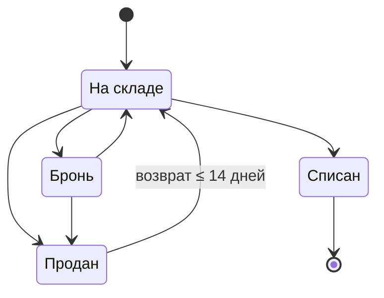

# Статусы ноутбука на складе

Конечный автомат на TypeScript: смена статуса ноутбука с валидацией переходов,
условием на возврат и журналом изменений. Плюс HTTP-API с хранением в SQLite
и демо-интерфейс на React, в котором автомат можно потрогать руками.

Ноль рантайм-зависимостей во всём проекте · 171 тест · 100% покрытия домена
(порог зашит в конфиг) · `strict` + `noUncheckedIndexedAccess` +
`exactOptionalPropertyTypes`.

> Зависимостей нет и у сервера: база — встроенный в Node модуль `node:sqlite`,
> HTTP — `node:http`. В `package.json` секции `dependencies` просто нет;
> всё, что в `devDependencies`, нужно сборке, тестам и демо-фронтенду.

---

## План

Составлен до написания кода.

1. **Описать автомат данными, а не кодом.** Статусы, граф допустимых переходов и
   условия на рёбрах — один источник истины, из которого выводятся и рантайм-проверки,
   и типы уровня компиляции.
2. **Написать чистую функцию** `changeStatus(laptop, to, { now })`: проверяет переход,
   проверяет условие возврата, дописывает запись в журнал, возвращает новый объект.
3. **Сделать ошибку частью типа результата** (`Result<Laptop, TransitionError>`) — с
   машинным кодом, русским сообщением и структурированными деталями; плюс обёртка
   `changeStatusOrThrow` для кода, которому удобнее исключение.
4. **Закрыть тестами:** исчерпывающая матрица 4×4, границы окна возврата, несколько
   циклов продажи, испорченные данные, инварианты журнала.
5. **Зафиксировать в README** неоднозначности ТЗ и принятые по ним решения.

---

## Автомат



| Из | Куда можно | Условие |
|---|---|---|
| `На складе` | `Бронь`, `Продан`, `Списан` | — |
| `Бронь` | `На складе`, `Продан` | — |
| `Продан` | `На складе` | не позднее 14 дней после продажи |
| `Списан` | — | конечный статус |

---

## Быстрый старт

```bash
npm install
npm run dev         # API на :5055 и интерфейс на http://localhost:5173 — одной командой
npm test            # 171 тест
npm run typecheck   # домен + сервер + фронтенд, включая проверки уровня типов в тестах
npm run coverage    # 100% по домену, ≥90% по серверу
npm run build       # домен: ESM + .d.ts в dist/
npm run build:server
npm run build:web   # интерфейс: статика в dist-web/
```

`npm run check` прогоняет typecheck и coverage вместе. База создаётся
автоматически в `data/laptops.db` при первом запуске и наполняется примерами.
Порты переопределяются через `PORT` и `API_PORT`.

---

## Визуализация

`npm run dev` открывает доску со статусами: четыре колонки, карточки-ноутбуки
перетаскиваются мышью или с клавиатуры.

**Во фронтенде нет ни одного правила автомата.** Колонки, подсказки, запреты, крайние
сроки и тексты ошибок получены вызовами `changeStatus`, `availableTransitions`,
`returnDeadline` и `ALLOWED_TRANSITIONS` из `src/`. Интерфейс не знает ни про 14 дней,
ни про то, что «Списан» конечный — он только задаёт домену вопросы и показывает ответы.
Поэтому доска не может разойтись с тестами: за ними стоит один и тот же код.

Три вещи, ради которых это стоит открыть:

1. **Пока карточку тащат, каждая колонка показывает вердикт домена именно по ней** —
   либо «можно отпустить», либо код ошибки и её дословный текст. Видно не только
   «куда нельзя», но и почему.
2. **Часами можно двигать «сейчас»** (`−1 / +1 / +7 / +14 дней` или точная дата). Это
   единственный способ увидеть работу окна возврата: у проданного ноутбука на глазах
   исчезает возможность вернуться на склад. Домен принимает `options.now` ровно для
   этого — так же, как в тестах.
3. **Карточки, из которых нет ни одного хода, помечаются как «тупик»** — и сразу видно
   находку из раздела ниже: проданный ноутбук с истёкшим сроком попадает в тупик
   наравне со списанным, хотя «Продан» формально не конечный статус.

Кнопка **«Добавить ноутбук»** есть ровно в одной колонке — и вёрстка не выбирает,
в какой: она показывается там, где `status === INITIAL_STATUS`. Куда приезжает новый
ноутбук, знает домен. Идентификатор и случайное название модели выдаёт сервер:
каталог живёт рядом с таблицей, а не в интерфейсе.

Страница разделена на две вкладки: **«Доска»** и **«Журнал попыток»** со счётчиком
записей. Журнал пишет **все** обращения к домену, включая отклонённые, с кодом ошибки
и исходным сообщением. Всё это лежит в SQLite и переживает перезагрузку страницы.
Управление часами и кнопка сброса остаются над вкладками: они относятся к обеим.

Стек: React 19, shadcn/ui (Tailwind v4), dnd-kit, Vite. Перетаскивание доступно
с клавиатуры: Tab до карточки, Пробел — взять, стрелки — выбрать колонку, Пробел —
отпустить, Escape — отменить.

---

## Слои и где что живёт

```
       браузер                      сервер                     SQLite
  ┌─────────────────┐        ┌──────────────────┐        ┌──────────────┐
  │ React + dnd-kit │  HTTP  │  node:http       │  SQL   │  laptops     │
  │                 │ ─────► │  репозиторий     │ ─────► │  status_     │
  │  ┌───────────┐  │        │  ┌────────────┐  │        │   history    │
  │  │  ДОМЕН    │  │        │  │   ДОМЕН    │  │        │  transition_ │
  │  │ src/      │  │        │  │   src/     │  │        │   attempts   │
  │  └───────────┘  │        │  └────────────┘  │        └──────────────┘
  │  мгновенная     │        │  авторитетное    │
  │  подсказка      │        │  решение         │
  └─────────────────┘        └──────────────────┘
```

**Домен изоморфен — один и тот же модуль работает на обеих сторонах.** У `src/`
нет ни зависимостей, ни обращений к DOM или к Node API, поэтому он без изменений
исполняется и в браузере, и на сервере:

- в браузере — чтобы во время перетаскивания мгновенно, без обращения к сети,
  показать вердикт по каждой колонке;
- на сервере — чтобы принять авторитетное решение перед записью в базу.

Правила существуют ровно в одном месте. Клиент ничего не «проверяет заранее» своей
копией логики: он задаёт тот же вопрос тому же коду. Если ответы разойдутся
(например, доску изменили в другой вкладке), побеждает сервер — он возвращает
актуальную доску прямо в ответе с ошибкой, и интерфейс перерисовывается.

Граница слоёв проверяется компилятором: домен собирается без `lib: DOM`, поэтому
обращение к браузерному API из `src/` не скомпилируется, а `server/` и `web/`
не могут «дописать» правило, минуя домен, — у них для этого просто нет кода.

---

## Хранение

Три таблицы, схема — в [`server/schema.ts`](server/schema.ts):

| Таблица | Что хранит |
|---|---|
| `laptops` | текущий статус, каталожное название, `version` для оптимистической блокировки |
| `status_history` | журнал изменений: `from_status`, `to_status`, `changed_at` — ровно то, что требует ТЗ |
| `transition_attempts` | аудит **всех** попыток, включая отклонённые: код ошибки, сообщение, модельное «сейчас» |

Несколько решений, которые стоит отметить:

**Инварианты домена продублированы на уровне СУБД — намеренно.** Журнал
append-only не только в коде: два триггера запрещают `UPDATE` и `DELETE` на
`status_history`, поэтому переписать историю нельзя даже запросом в обход
приложения. `CHECK (from_status <> to_status)` закрепляет тот же инвариант,
который проверяет model-based тест. Это не дублирование логики, а разные рубежи
защиты: домен охраняет свои правила от кода, база — от всего остального.

**Список статусов в `CHECK` печатается из `ALL_STATUSES`**, а не переписывается
руками: домен остаётся источником истины даже для ограничений БД.

**Сброс демо делает `DROP TABLE`, а не `DELETE`** — обходить собственные триггеры
ради кнопки «сбросить» значило бы ослабить инвариант.

**Оптимистическая блокировка.** Клиент присылает `expectedVersion`; `UPDATE ...
WHERE id = ? AND version = ?` не затронет ни одной строки, если ноутбук успели
изменить в другой вкладке, и сервер ответит `409 VERSION_CONFLICT` вместо того,
чтобы молча потерять чужое изменение.

**Смена статуса и запись в журнал — одна транзакция.** Состояния «статус
поменялся, а в истории пусто» не бывает.

### API

| Запрос | Ответ |
|---|---|
| `GET /api/board` | все ноутбуки с историей + аудит попыток |
| `POST /api/laptops` | новый ноутбук: `201` + `createdId` и обновлённая доска |
| `POST /api/laptops/:id/status` | `{ to, now?, expectedVersion? }` → обновлённая доска |
| `POST /api/reset` | пересоздать таблицы и наполнить заново |

Статус нового ноутбука не задаётся запросом: его ставит домен через `createLaptop()`.
Номер вычисляется как `MAX(…) + 1` по числовой части в той же транзакции, что и
вставка, — два одновременных добавления не получат один и тот же идентификатор.

Коды ошибок домена переводятся в HTTP таблицей, которую `satisfies
Record<TransitionErrorCode, number>` делает исчерпывающей — новый код ошибки
сломает сборку, а не уедет тихо в 500:

| Код домена | HTTP | Почему |
|---|---|---|
| `SAME_STATUS`, `TERMINAL_STATUS`, `TRANSITION_NOT_ALLOWED`, `RETURN_WINDOW_EXPIRED` | `409` | запрос понятен и корректен, но состояние ресурса его не допускает |
| `UNKNOWN_STATUS`, `INVALID_DATE` | `400` | испорченный ввод |
| `SALE_DATE_UNKNOWN` | `422` | данных не хватает, чтобы правило вообще можно было проверить |

При отказе сервер возвращает **и ошибку, и актуальную доску** — клиенту не нужен
второй запрос, чтобы остаться в синхронном состоянии.

> Поле `now` в запросе — осознанная поблажка демонстрации: иначе работу окна
> возврата не показать. В реальной системе сервер использовал бы только свои часы,
> потому что клиентскому времени доверять нельзя. Это отмечено и в коде.

---

## Пример

```ts
import { changeStatus, createLaptop, LaptopStatus, returnDeadline } from './src/index.js';

// 1. Новый ноутбук приходит на склад.
let laptop = createLaptop({ id: 'nb-42' });

// 2. Продаём его 18 января.
const sale = changeStatus(laptop, LaptopStatus.Sold, {
  now: new Date('2026-01-18T10:00:00.000Z'),
});
if (!sale.ok) throw new Error(sale.error.message);
laptop = sale.value;

returnDeadline(laptop);
// → 2026-02-01T10:00:00.000Z — возврат возможен до этого момента включительно

// 3. Покупатель приходит через 20 дней — срок истёк.
const late = changeStatus(laptop, LaptopStatus.InStock, {
  now: new Date('2026-02-07T10:00:00.000Z'),
});

if (!late.ok) {
  late.error.code; // 'RETURN_WINDOW_EXPIRED'
  late.error.message;
  // 'Возврат невозможен: срок возврата истёк. Ноутбук продан 2026-01-18T10:00:00.000Z,
  //  вернуть его можно было не позднее 2026-02-01T10:00:00.000Z включительно,
  //  сейчас 2026-02-07T10:00:00.000Z.'
}

// 4. А через 5 дней — успешно, и в журнале появляется вторая запись.
const inTime = changeStatus(laptop, LaptopStatus.InStock, {
  now: new Date('2026-01-23T10:00:00.000Z'),
});

if (inTime.ok) {
  inTime.value.history;
  // [
  //   { from: 'IN_STOCK', to: 'SOLD',     at: 2026-01-18T10:00:00.000Z },
  //   { from: 'SOLD',     to: 'IN_STOCK', at: 2026-01-23T10:00:00.000Z },
  // ]
}
```

Этот пример не просто записан здесь — он целиком прогоняется в
[`tests/readme.test.ts`](tests/readme.test.ts). Расхождение README с кодом роняет сборку.

---

## API

| Функция | Назначение |
|---|---|
| `changeStatus(laptop, to, options?)` | Основная функция. Возвращает `Result<Laptop, TransitionError>` |
| `changeStatusOrThrow(laptop, to, options?)` | То же, но бросает `StatusTransitionError` |
| `changeStatusStrict(laptop, to, options?)` | Проверяет переход **на этапе компиляции**, если статус известен типу как литерал |
| `canChangeStatus(laptop, to, options?)` | Предикат |
| `availableTransitions(laptop, options?)` | Фактически доступные переходы — с учётом условий на рёбрах |
| `allowedTransitionsFrom(status)` | Переходы по графу, без учёта условий |
| `returnDeadline(laptop)` | До какого момента возможен возврат, или `null` |
| `resolveSaleDate(laptop)` | Дата последней продажи |
| `createLaptop(input)` | Конструктор: замораживает результат, копирует даты |

### Коды ошибок

Каждая ошибка — это машинный `code`, готовое русское `message` и структурированные
детали. Чтобы понять, что произошло, сообщение парсить не нужно.

| `code` | Когда | Детали |
|---|---|---|
| `TRANSITION_NOT_ALLOWED` | ребра нет в графе | `from`, `to`, `allowed` |
| `TERMINAL_STATUS` | уход из `Списан` | `from`, `to` |
| `SAME_STATUS` | переход в тот же статус | `status` |
| `RETURN_WINDOW_EXPIRED` | возврат позже 14 дней | `soldAt`, `now`, `deadline`, `windowDays`, `msElapsed`, `daysElapsed` |
| `SALE_DATE_UNKNOWN` | дату продажи определить нельзя | — |
| `INVALID_DATE` | битая дата или `now` раньше продажи | `field`, `reason` |
| `UNKNOWN_STATUS` | значение не из перечисления | `field`, `received`, `allowedValues` |

```ts
if (!result.ok) {
  switch (result.error.code) {
    case 'RETURN_WINDOW_EXPIRED':
      // deadline типизирован как Date — показываем пользователю срок
      return showExpired(result.error.deadline);
    case 'TRANSITION_NOT_ALLOWED':
      return showOptions(result.error.allowed);
    // ...компилятор не даст забыть ни один код
  }
}
```

---

## Решения

**Автомат описан данными.** Граф — один `as const`-объект, условия на рёбрах — отдельная
карта. Движок `changeStatus` про конкретные правила не знает ничего, поэтому новое
правило («бронь не дольше 3 дней», «списание только со склада») добавляется данными,
а не правкой тела функции.

```ts
export const ALLOWED_TRANSITIONS = {
  IN_STOCK: ['RESERVED', 'SOLD', 'WRITTEN_OFF'],
  RESERVED: ['IN_STOCK', 'SOLD'],
  SOLD: ['IN_STOCK'],
  WRITTEN_OFF: [],
} as const satisfies Record<LaptopStatus, readonly LaptopStatus[]>;

const GUARDS: Partial<Record<TransitionKey, Guard>> = {
  'SOLD->IN_STOCK': returnWindowGuard,
};
```

`satisfies Record<LaptopStatus, …>` гарантирует, что ни один статус не забыт: новый
статус без описанных переходов не скомпилируется.

**Типы выводятся из того же графа.** Дублирования между «графом для рантайма» и
«типами для компилятора» нет вообще:

```ts
type AllowedTarget<From> = (typeof ALLOWED_TRANSITIONS)[From][number];

AllowedTarget<'SOLD'>;        // 'IN_STOCK'
AllowedTarget<'WRITTEN_OFF'>; // never — терминальность доказана типами
TerminalStatus;               // 'WRITTEN_OFF' — вычислено, а не зашито строкой
```

**Ошибка — часть типа результата.** `Result<Laptop, TransitionError>` вместо исключения:
ТЗ говорит буквально «возвращает понятную ошибку», и при `Result` компилятор не даёт
обратиться к `value`, не проверив `ok`. Забыть обработать ошибку невозможно.

**Функция чистая.** Возвращает новый замороженный объект; вход не мутируется; даты
копируются на входе и при записи в журнал, поэтому подменить историю, изменив
переданный объект `Date` после вызова, нельзя.

> Оговорка, сделанная осознанно: `Object.freeze` защищает только собственные свойства,
> а `Date` хранит время во внутреннем слоте — заморозка его не закрывает. Поэтому
> неизменяемость дат обеспечивается копированием, а не freeze'ом. Ограничение
> зафиксировано отдельным тестом в `tests/invariants.test.ts`. Если бы требовалась
> неизменяемость и для уже выданных наружу значений, журнал хранил бы ISO-строки.

**Часы инжектируются** (`options.now`, по умолчанию `new Date()`). Без этого правило
14 дней нельзя проверить точно, не подменяя глобальный таймер.

**Даты в сообщениях — ISO-8601 UTC.** Формат детерминирован и не зависит от локали
сервера, поэтому его можно закрепить тестом. Человекочитаемое «18 января, 13:00» — дело
презентационного слоя, у которого есть таймзона конкретного пользователя.

**Порядок проверок зафиксирован тестами**, потому что он определяет, какую из нескольких
одновременно применимых ошибок увидит пользователь: `UNKNOWN_STATUS` → `INVALID_DATE` →
хронология журнала → `SAME_STATUS` → `TERMINAL_STATUS` → `TRANSITION_NOT_ALLOWED` →
условие на ребре.

### Почему не `enum`

Статусы — это `as const`-объект и выведенный из него union, а не `enum`. Три причины,
каждая проверена, а не принята на веру:

1. **Повторы строк и так проверяются компилятором.** Это не копипаста, а три проекции
   одного закрытого множества, и `satisfies` сверяет каждую с единственным источником.
   Опечатка в ключе графа, в значении, пропущенный статус, забытая подпись — всё это
   не компилируется, причём TypeScript ещё и подсказывает: `Type '"RESERVD"' is not
   assignable to 'LaptopStatus'. Did you mean '"RESERVED"'?`
2. **`enum` сломал бы границу системы.** Строковые enum номинальные: ни `'SOLD'`,
   ни `string` из БД или JSON в них не присваиваются. Пришлось бы расставлять касты
   ровно там, где нужна строгость. Сейчас `changeStatus(nb, 'SOLD')` просто работает,
   а `isLaptopStatus()` честно сужает `unknown`.
3. **`enum` — единственная конструкция TypeScript, порождающая рантайм-код.**
   `node --experimental-strip-types` отвергает его прямо: `TypeScript enum is not
   supported in strip-only mode`, и у самого TypeScript есть флаг `erasableSyntaxOnly`,
   добавленный под это.

И главное: количество упоминаний `enum` не уменьшает — он лишь заменяет `'IN_STOCK'`
на более длинное `LaptopStatus.InStock` в тех же местах. Таблицу переходов,
которую сейчас можно построчно сверить с ТЗ за секунду, это сделало бы нечитаемой.

---

## Что было непонятно и как я это решил

**1. Откуда вообще берётся дата продажи.** В ТЗ её нет среди входных данных, а правило
14 дней без неё не проверить. Решение: источник истины — история, которую то же ТЗ
требует вести; дата продажи = дата последнего перехода в «Продан». Отдельное поле
`soldAt` оставлено только как запасной источник для записей, импортированных без
истории: два равноправных источника одной даты неизбежно рассинхронизируются.

**2. От какой продажи считать 14 дней.** ТЗ не говорит, что делать, если ноутбук
продавали несколько раз (`продан → возврат → продан снова`). Решение: от последней
продажи. Закреплено тестом: через 40 дней после первой продажи, но через 10 после
второй — возврат возможен.

**3. Что если дату продажи определить нельзя.** Решение: отдельная ошибка
`SALE_DATE_UNKNOWN`, а не «молчаливо разрешить» и не «молчаливо запретить».
Невозможность проверить правило — это не то же самое, что нарушение правила, и
смешивать их в одну ветку означает потерять информацию о причине.

**4. Граница «не позднее 14 дней» — включительная?** Прочитал как `≤ 14 дней`: ровно
14 суток — ещё можно, 14 суток и 1 миллисекунда — уже нет. Граница закреплена тестами
с трёх сторон: `14д − 1мс`, ровно `14д`, `14д + 1мс`.

**5. Сутки или календарные дни.** Выбраны фиксированные 14 × 24 ч. Календарный вариант
потребовал бы политики таймзоны (у склада в Москве и у покупателя в Калининграде «день»
разный) и ломался бы на переходе на летнее время; в ТЗ таймзона не задана. Фиксированные
сутки — единственный вариант, который можно однозначно закрепить тестом.

**6. «Возвращает ошибку» или бросает исключение.** В ТЗ буквально «возвращает», поэтому
основная функция возвращает `Result`. Но раз формулировка допускает и второе прочтение,
добавлена обёртка `changeStatusOrThrow` — она стоит четыре строки и закрывает оба
варианта, вместо того чтобы выбирать за проверяющего.

**7. Переход в тот же статус** в таблице ТЗ не описан. Считаю недопустимым, но с
отдельным кодом `SAME_STATUS` и своим сообщением («Ноутбук уже в статусе «Бронь»»):
это самая частая ошибка интеграции, и общее «переход запрещён» здесь только путает.

**8. Что считать «понятной ошибкой».** Решение: понятная человеку — это русский текст с
названиями статусов как в ТЗ; понятная коду — это стабильный `code` и структурированные
детали. Если отдать только текст, вызывающий код начнёт его парсить; если только код —
сообщение придётся собирать в каждом интерфейсе заново.

**9. Мутирует ли функция объект и откуда берётся «сейчас».** В ТЗ не сказано ни того,
ни другого. Сделал чистую функцию с инжектируемыми часами — иначе тесты про 14 дней
получаются либо хрупкими, либо требуют мокать глобальное время.

**10. Что делать с испорченными данными.** В ТЗ этого нет, но на границе системы
(JSON из запроса, запись из БД) в поле типа `Date` вполне может оказаться строка или
`Invalid Date`, а статусом — что угодно: типы TypeScript в рантайме не существуют.
Здесь важная деталь: если не проверять дату, арифметика пойдёт по `NaN`, а `NaN > срок`
даёт `false` — то есть битая дата **молча разрешила бы любой возврат**. Поэтому
`INVALID_DATE` и `UNKNOWN_STATUS` — отдельные ошибки, а не ветка «всё хорошо».

**11. Пробелы в самой таблице переходов — их я не стал «исправлять» домыслом.**
Реализовано строго по ТЗ, но в реальном проекте это первое, что я бы вынес заказчику:

- `Бронь → Списан` в ТЗ нет: забронированный ноутбук нельзя списать, не снимая брони;
- `Продан → Списан` тоже нет: списать проданный можно только через возврат на склад;
- **и главное:** проданный ноутбук через 14 дней попадает в тупик. Из «Продан» по ТЗ
  ведёт единственное ребро — возврат на склад, и условие закрывает его навсегда. Списать
  его нельзя. То есть такой ноутбук нельзя ни вернуть, ни списать: формально «Продан» —
  не конечный статус, фактически — конечный, и ни один ноутбук из него уже не выйдет.

  Это нашёл не я глазами, а model-based тест: случайный обход автомата «застревал» не в
  «Списан», как ожидалось, а в «Продан». Поведение зафиксировано тестом
  («фактический тупик») — похоже, в ТЗ не хватает перехода `Продан → Списан`.

**12. Должен ли журнал быть хронологическим.** В ТЗ про это ни слова, и поначалу
домен это и не проверял. Пробел вскрылся, когда появилась база: журнал стал
переживать перезагрузку и читаться в порядке записи, а в интерфейсе есть кнопка
«−1 день». Значит можно было записать переход задним числом и получить историю,
в которой время идёт вспять, — а `resolveSaleDate` берёт последнюю запись
**по позиции в массиве**, и она перестала бы совпадать с последней **по дате**.

Решение: переход раньше последней записи журнала возвращает `INVALID_DATE`
с причиной `now_before_last_change`. Граница включительна — тот же момент
допустим. Теперь порядок записи и порядок по датам совпадают, и на этом
держится чтение истории из БД.

Любопытно, что инвариант «время в журнале не идёт назад» мой model-based тест
проверял с самого начала — просто случайный обход двигал часы только вперёд
и не мог его нарушить.

---

## Какие запросы я давал AI

Работа сделана в паре с Claude (Claude Code). Ниже — что именно спрашивалось,
в порядке, в котором это происходило.

1. **«В папке есть задание в docx. Давай прочитаем его и подумаем, что это и как делать.
   Мне самому кажется, что это очень напоминает конечный автомат.»** — задало рамку всего
   решения: автомат с графом и условиями на рёбрах, а не набор `if`-ов в одной функции.
2. **Просьба сделать работу максимально качественно и сделать больше, чем просит ТЗ** —
   из этого выросли 100% покрытие с порогом в конфиге, проверки уровня типов и
   model-based тест.
3. **Ответы на уточняющие вопросы**, которые AI задал до написания кода (он спросил про
   объём «сверх задания», про разметку коммитов и про формат сдачи). Моё решение на том
   шаге: сначала ядро и инфраструктура, без HTTP-слоя и UI.
4. **«А не будет ли оптимальнее заменить строки на `enum`, чтобы нигде не дублировать?»** —
   разбор привёл к обратному выводу и к отдельному пункту «Почему не `enum`» ниже.
5. **«Добавь фронтенд — доску со статусами, карточки перетаскиваются между колонками,
   React + shadcn/ui.»**
6. **«Сделай SQLite, чтобы при перезагрузке страницы всё сохранялось: таблицу ноутбуков,
   историю перемещений, возможно ещё какую-то.»** — третьей стала таблица аудита попыток:
   в интерфейсе уже был журнал отказов, и он просился в хранилище.

### Что пришлось поправить по ходу

Это, пожалуй, самое полезное в разделе: ошибки ловились не глазами, а тестами
и интеграцией.

1. В одном из тестов был записан переход `Продан → Списан`, которого в ТЗ нет. Поймала
   исчерпывающая матрица 4×4 — именно потому, что таблица ожиданий в ней написана руками
   по ТЗ, а не выведена из того же графа, что проверяется.
2. Проверки уровня типов были написаны как код на верхнем уровне модуля, и Vitest их
   исполнял: попытка присвоить поле замороженного объекта честно падала с `TypeError`.
   Перенесены в функцию, которая никогда не вызывается, — компилятор её проверяет,
   рантайм не трогает.
3. Model-based обход застревал и давал 7 успешных переходов из 2000. Разбор причины
   привёл к находке про тупик в статусе «Продан» (пункт 11 выше).
4. Добавление базы вскрыло, что журнал мог стать нехронологическим (пункт 12 выше).
5. В журнале попыток обрезались длинные сообщения: у `TableCell` в shadcn/ui стоит
   `whitespace-nowrap`.
6. Проверка размера тела запроса сначала рвала сокет раньше, чем уходил ответ, —
   клиент получал `ECONNRESET` вместо `413`. Теперь остаток тела дочитывается
   и отбрасывается.
7. Тест на повреждённые данные не падал там, где ожидалось: у колонки `TEXT` в SQLite
   текстовая аффинность, и число молча приводится к строке. Понадобился `BLOB`.

---

## Тесты

171 тест. Домен покрыт на 100% (`statements` / `branches` / `functions` / `lines`),
серверный слой — не ниже 90%; пороги зашиты в `vitest.config.ts`, поэтому непокрытая
ветка роняет сборку. На 100% сервер не натягивался намеренно: часть веток там —
защита от сбоев инфраструктуры, которые честнее не инсценировать ради цифры
в отчёте. Точка входа процесса (`server/index.ts`) из покрытия исключена: это
композиция зависимостей без логики.

| Файл | Что проверяет |
|---|---|
| [`transitions.test.ts`](tests/transitions.test.ts) | Исчерпывающая матрица всех 16 пар статусов; содержимое записей журнала; тексты ошибок дословно; значения не из перечисления |
| [`returnWindow.test.ts`](tests/returnWindow.test.ts) | Границы окна с трёх сторон; несколько циклов продажи; приоритет истории над `soldAt`; битые даты; хронология журнала; фактический тупик |
| [`invariants.test.ts`](tests/invariants.test.ts) | Model-based обход на 2000 шагов с воспроизводимым сидом; неизменяемость и заморозка |
| [`types.test.ts`](tests/types.test.ts) | Проверки уровня типов: 10 утверждений `@ts-expect-error` и сравнения типов |
| [`readme.test.ts`](tests/readme.test.ts) | Пример из README исполняется целиком |
| [`server/persistence.test.ts`](tests/server/persistence.test.ts) | Круговой рейс агрегата через БД; триггеры append-only; `CHECK` и внешние ключи; оптимистическая блокировка; откат транзакции; повреждённые данные; **выживание после перезапуска процесса** |
| [`server/api.test.ts`](tests/server/api.test.ts) | Все коды домена → коды HTTP; аудит успехов и отказов; разбор запроса; конфликт версий; сброс |
| [`server/http.test.ts`](tests/server/http.test.ts) | Настоящий HTTP-сервер на свободном порту: маршруты, 404/405/413, битый JSON |

**Матрица 4×4 построена на таблице ожиданий, переписанной руками прямо из ТЗ.** Это
принципиально: тест, выведенный из того же `ALLOWED_TRANSITIONS`, что и проверяемый код,
не поймал бы ошибку в самом графе — он бы её добросовестно повторил.

**Model-based тест** гоняет 2000 случайных переходов (свой PRNG `mulberry32` с
фиксированным сидом — падение воспроизводимо, внешняя библиотека не нужна) и после
каждого шага проверяет инварианты агрегата:

- статус всегда принадлежит перечислению;
- журнал только дописывается — прежние записи не переписываются;
- записи смыкаются в цепочку: `history[i].to === history[i+1].from`;
- цепочка начинается с исходного статуса и заканчивается текущим;
- время в журнале не идёт назад;
- каждая запись соответствует реальному ребру графа, и `from ≠ to`;
- вход не мутируется ни при успехе, ни при ошибке;
- из тупика не проходит ни один переход.

Отдельно тест требует, чтобы обход оказался содержательным: больше 100 успешных
переходов, оба вида тупика встречены, и все четыре достижимых кода ошибок задеты.
Иначе «зелёный» тест мог бы просто ничего не проверять.

---

## Структура

```
src/                     ДОМЕН — без зависимостей, без React, без DOM, без SQL
  status.ts              статусы, граф переходов, вывод типов из графа
  types.ts               Laptop, StatusChange, Result, union ошибок
  errors.ts              конструкторы ошибок, русские сообщения, StatusTransitionError
  changeStatus.ts        движок автомата и условия на рёбрах
  index.ts               публичный API (явные реэкспорты, без export *)

server/                  АДАПТЕРЫ — SQL и HTTP, ни одного правила автомата
  schema.ts              схема БД; список статусов печатается из домена
  db.ts                  открытие, миграция, сброс, транзакции
  repository.ts          единственное место, где агрегат ↔ строки таблиц
  api.ts                 обработчики, DTO, таблица «код домена → код HTTP»
  http.ts                маршрутизация на node:http
  seed.ts                наполнение; истории собираются самим доменом
  index.ts               точка входа процесса

web/src/                 ИНТЕРФЕЙС — только отображение, правил нет
  lib/api.ts             граница сети: DTO ↔ доменные агрегаты
  lib/board.ts           состояние доски и вердикты домена для подсказок
  lib/format.ts          даты и склонения для человека — презентация
  components/            StatusBoard, StatusColumn, LaptopCard, ClockControl,
                         EventLog, HistoryDialog
  components/ui/         компоненты shadcn/ui

tests/                   171 тест
  transitions returnWindow invariants types readme     — домен
  server/persistence  server/api  server/http          — сервер
```

---

## Сверх задания

ТЗ просило функцию и тесты к ней. Дополнительно сделано:

- **Проверка переходов на этапе компиляции** — `AllowedTarget<From>` выводится из того же
  графа, `AllowedTarget<'WRITTEN_OFF'>` вычисляется в `never`. Вызвать
  `changeStatusStrict` для списанного ноутбука невозможно в принципе: у аргумента нет
  ни одного допустимого значения.
- **10 утверждений уровня типов** через `@ts-expect-error`, которые проверяет `tsc`.
  Если ошибки компиляции не произойдёт, сборка упадёт на «неиспользованной директиве» —
  то есть это настоящие тесты, а не комментарии.
- **Model-based тест**, который и нашёл пробел в ТЗ.
- **100% покрытия с порогом в конфиге**, а не «посмотрели и порадовались».
- **`availableTransitions` и `returnDeadline`** — то, что нужно интерфейсу, чтобы не
  дублировать правила автомата в кнопках и подсказках.
- **Исчерпывающий разбор ошибок**: новый код ошибки сломает сборку в каждом месте, где
  его забыли обработать.
- **Исполняемый README**: пример прогоняется тестом.
- **Сборка в ESM + `.d.ts`**, ноль рантайм-зависимостей, работает на чистом Node.
- **Демо-интерфейс** на React + shadcn/ui + dnd-kit: доска со статусами, в которой
  видно работу автомата — включая вердикт домена по каждой колонке во время
  перетаскивания и управление модельным временем. Правил автомата в нём нет ни одного.
- **HTTP-API и хранение в SQLite** на встроенных модулях Node — состояние переживает
  перезагрузку, не добавляя проекту ни одной рантайм-зависимости.
- **Инварианты домена закреплены ещё и в схеме БД**: триггеры делают журнал
  append-only на уровне СУБД, а не только в коде.
- **Оптимистическая блокировка и транзакции** — изменение из соседней вкладки
  не теряется молча, а «статус поменялся, история пуста» невозможно в принципе.
- **Домен изоморфен**: один и тот же модуль даёт мгновенную подсказку в браузере
  и принимает авторитетное решение на сервере. Правила не продублированы
  между клиентом и сервером ни строкой.
