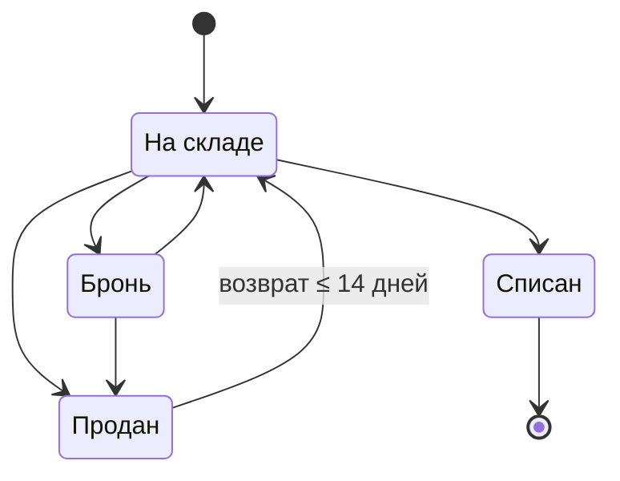

# Статусы ноутбука на складе

Конечный автомат на TypeScript: менять статус ноутбука, проверять переход, следить
за сроком возврата, писать журнал. Плюс HTTP-API с хранением в SQLite и демо на
React, где автомат можно потрогать рукой.

Ноль рантайм-зависимостей во всём проекте · 205 тестов · 100% покрытия домена
(порог зашит в конфиг) · `strict` + `noUncheckedIndexedAccess` +
`exactOptionalPropertyTypes`.

> У сервера зависимостей тоже ноль: база — встроенный `node:sqlite`, HTTP —
> `node:http`. Секции `dependencies` в `package.json` просто нет. Всё, что
> в `devDependencies`, нужно сборке, тестам и демо-фронту.

---

## План

Написан ДО кода.

1. **Описать автомат данными, не кодом.** Статусы, граф переходов и условия
   на рёбрах — один источник истины. Из него расти и проверка в рантайм, и тип.
2. **Написать чистую функцию** `changeStatus(laptop, to, { now })`: проверить
   переход, проверить срок, дописать журнал, вернуть новый объект.
3. **Сделать ошибку частью типа результата** (`Result<Laptop, TransitionError>`):
   код для машины, русский текст для человека, детали для UI. Плюс обёртка
   `changeStatusOrThrow` для тех, кому удобнее бросок.
4. **Закрыть тестами:** полная матрица 4×4, границы окна возврата, несколько
   циклов продажи, битые данные, инварианты журнала.
5. **Записать в README** всё непонятное в ТЗ и что моя с этим делать.

---

## Автомат



| Из | Куда можно | Условие |
|---|---|---|
| `На складе` | `Бронь`, `Продан`, `Списан` | — |
| `Бронь` | `На складе`, `Продан` | — |
| `Продан` | `На складе` | не позднее 14 дней после продажи |
| `Списан` | — | конец, хода нет |

---

## Быстрый старт

```bash
npm install
npm run dev         # API на :5055 и интерфейс на http://localhost:5173 — одной командой
npm test            # 205 тестов
npm run typecheck   # домен + сервер + фронт, вместе с проверками уровня типов
npm run coverage    # 100% по домену, ≥90% по серверу
npm run build       # домен: ESM + .d.ts в dist/
npm run build:server
npm run build:web   # интерфейс: статика в dist-web/
```

`npm run check` гонять typecheck и coverage вместе. База рождаться сама
в `data/laptops.db` при первом запуске и наполняться примерами. Порты менять
через `PORT` и `API_PORT`.

---

## Визуализация

`npm run dev` открывать доску: четыре колонки, карточки таскать мышью или
с клавиатуры.

**Во фронте нет ни одного правила автомата.** Колонки, подсказки, запреты, сроки
и тексты ошибок приходить из `changeStatus`, `availableTransitions`,
`returnDeadline` и `ALLOWED_TRANSITIONS`. Интерфейс не знать ни про 14 дней,
ни про то, что «Списан» конечный. Он только спрашивать домен и показывать ответ.
Поэтому доска разойтись с тестами не может: за ними один и тот же код.

Три вещи, ради которых стоит открыть:

1. **Карточку тащат — каждая колонка показывать ответ домена про себя.** Либо
   «можно отпустить», либо код ошибки и её дословный текст. Видно не только
   куда нельзя, но и почему.
2. **Часы можно двигать** (`−1 / +1 / +7 / +14 дней` или точная дата). Это
   единственный способ увидеть работу окна возврата: у проданного ноутбука
   на глазах пропадать возможность вернуться. Домен брать `options.now` ровно
   для этого — как в тестах.
3. **Карточка без единого хода помечаться «тупик».** Сразу видно находку
   из раздела ниже: проданный с истёкшим сроком попадать в тупик наравне
   со списанным, хотя «Продан» формально не конечный.

Кнопка **«Добавить ноутбук»** стоять ровно в одной колонке — и вёрстка не выбирать,
в какой. Она появляться там, где `status === INITIAL_STATUS`. Куда приезжать новому
ноутбуку — знать домен. Номер и случайное название давать сервер: каталог жить
рядом с таблицей, не в интерфейсе.

Страница делиться на две вкладки: **«Доска»** и **«Журнал попыток»** со счётчиком.
Переключатель стоять в шапке, справа от заголовка. Часы и кнопка сброса видны
на обеих — они нужны обеим.

Журнал писать **все** обращения к домену, и отказы тоже, с кодом ошибки
и исходным текстом. Всё лежать в SQLite и переживать перезагрузку.

Стек: React 19, shadcn/ui (Tailwind v4), dnd-kit, Vite. Таскать можно с клавиатуры:
Tab до карточки, Пробел — взять, стрелки — выбрать колонку, Пробел — отпустить,
Escape — отменить.

---

## Деплой

В образе лежать только скомпилированный JavaScript. `node_modules` не копировать:
рантайм-зависимостей нет вовсе. База — встроенный `node:sqlite`, HTTP — `node:http`.
Образ **236 МБ**, и почти весь это сам Node.

Собирать на `node:22-slim` (там предсказуемо ставиться бинарники rollup и esbuild),
запускать на `node:22-alpine`.

В проде Vite нет, поэтому **собранный фронт раздавать сам сервер**: один процесс
отвечать и за `/api/*`, и за файлы. Проще и дешевле, чем второй сервис ради трёх
файлов. Файл с хешем в имени кешировать навсегда, `index.html` — никогда: иначе
после деплоя браузер тянуть старую разметку со ссылками на удалённые файлы.

### Локально

```bash
docker build -t laptop-status-machine .
docker run -p 8080:8080 -e PORT=8080 -v laptop-data:/data laptop-status-machine
# http://localhost:8080
```

### Railway

Настройки лежать в [`railway.json`](railway.json): сборка по Dockerfile, проверка
живости на `/api/health`. `PORT` платформа подставлять сама.

> **Обязательно примонтировать том на `/data`.** Файловая система контейнера
> эфемерна: без тома база пересоздаваться при каждом деплое, и всё натыканное
> пропадать. Путь менять переменной `DB_PATH`.

| Переменная | Зачем | Умолчание |
|---|---|---|
| `PORT` | порт; подставлять платформа | `5055` |
| `DB_PATH` | файл базы — обязан лежать на томе | `/data/laptops.db` |
| `STATIC_DIR` | где собранный фронт | `/app/dist-web` (задан в образе) |

Контейнер работать не от root. Платформа примонтирует том от root и писать
не выйдет — приложение сказать это текстом, а не кодом `EACCES`. Чинить правами
на точку монтирования либо удалением строки `USER node`.

Проверка живости (`/api/health`) делать пустяковый запрос в базу, а не просто
отвечать 200: сервис, который кричать «жив» при мёртвой базе, вреднее молчащего —
балансировщик продолжить слать на него трафик.

---

## Слои и где что живёт

```
       браузер                      сервер                     SQLite
  ┌─────────────────┐        ┌──────────────────┐        ┌──────────────┐
  │ React + dnd-kit │  HTTP  │  node:http       │  SQL   │  laptops     │
  │                 │ ─────► │  репозиторий     │ ─────► │  status_     │
  │  ┌───────────┐  │        │  ┌────────────┐  │        │   history    │
  │  │  ДОМЕН    │  │        │  │   ДОМЕН    │  │        │  transition_ │
  │  │ src/      │  │        │  │   src/     │  │        │   attempts   │
  │  └───────────┘  │        │  └────────────┘  │        └──────────────┘
  │  мгновенная     │        │  авторитетное    │
  │  подсказка      │        │  решение         │
  └─────────────────┘        └──────────────────┘
```

**Домен изоморфен — один и тот же модуль крутиться с обеих сторон.** У `src/` нет
ни зависимостей, ни обращений к DOM или Node API, поэтому он без изменений работать
и в браузере, и на сервере:

- в браузере — чтобы при таскании мгновенно, без сети, показать ответ по каждой колонке;
- на сервере — чтобы принять настоящее решение перед записью в базу.

Правила лежать ровно в одном месте. Клиент не «проверять заранее» своей копией
логики: он задавать тот же вопрос тому же коду. Ответы разойтись (доску поменяли
в другой вкладке) — побеждать сервер: он вернуть актуальную доску прямо в ответе
с ошибкой, и интерфейс перерисоваться.

Границу слоёв стеречь компилятор: домен собираться без `lib: DOM`, поэтому
обращение к браузерному API из `src/` не скомпилироваться. А `server/` и `web/`
не могут дописать правило мимо домена — у них для этого просто нет кода.

---

## Хранение

Три таблицы, схема — в [`server/schema.ts`](server/schema.ts):

| Таблица | Что хранить |
|---|---|
| `laptops` | статус сейчас, название из каталога, `version` для блокировки |
| `status_history` | журнал: `from_status`, `to_status`, `changed_at` — ровно то, что просить ТЗ |
| `transition_attempts` | аудит **всех** попыток, и отказов тоже: код ошибки, текст, модельное «сейчас» |

Несколько решений, которые стоит отметить:

**Инварианты домена продублированы в СУБД — нарочно.** Журнал только дописывать
не только в коде: два триггера запрещать `UPDATE` и `DELETE` на `status_history`,
поэтому переписать историю нельзя даже запросом мимо приложения.
`CHECK (from_status <> to_status)` закреплять тот же инвариант, что проверять
model-based тест. Это не копия логики, а разные рубежи: домен стеречь свои правила
от кода, база — от всего остального.

**Список статусов в `CHECK` печатать из `ALL_STATUSES`**, не писать рукой: домен
остаться источником истины даже для ограничений базы.

**Сброс демо делать `DROP TABLE`, не `DELETE`** — обойти свои же триггеры ради
кнопки «сбросить» значило ослабить инвариант.

**Оптимистическая блокировка.** Клиент слать `expectedVersion`; `UPDATE … WHERE
id = ? AND version = ?` не тронуть ни строки, если ноутбук успели поменять
в другой вкладке, и сервер ответить `409 VERSION_CONFLICT` вместо того, чтобы
молча потерять чужое изменение.

**Смена статуса и запись журнала — одна транзакция.** Состояния «статус поменялся,
а в истории пусто» не бывать.

### API

| Запрос | Ответ |
|---|---|
| `GET /api/board` | все ноутбуки с историей + аудит попыток |
| `POST /api/laptops` | новый ноутбук: `201` + `createdId` и свежая доска |
| `POST /api/laptops/:id/status` | `{ to, now?, expectedVersion? }` → свежая доска |
| `POST /api/reset` | пересоздать таблицы и наполнить заново |

Статус нового ноутбука запросом не задавать: его ставить домен через `createLaptop()`.
Номер считать `MAX(…) + 1` по числу в той же транзакции, что и вставка — два
одновременных добавления не получить один номер.

Код ошибки домена переводить в HTTP таблицей, которую `satisfies
Record<TransitionErrorCode, number>` делать полной: новый код ошибки сломать
сборку, а не уехать тихо в 500.

| Код домена | HTTP | Почему |
|---|---|---|
| `SAME_STATUS`, `TERMINAL_STATUS`, `TRANSITION_NOT_ALLOWED`, `RETURN_WINDOW_EXPIRED` | `409` | запрос понятный и данные хорошие, а состояние не пускать |
| `UNKNOWN_STATUS`, `INVALID_DATE` | `400` | ввод битый |
| `SALE_DATE_UNKNOWN` | `422` | данных не хватать, правило вообще не проверить |

При отказе сервер возвращать **и ошибку, и свежую доску** — клиенту не нужен
второй запрос, чтобы остаться в синхроне.

> Поле `now` в запросе — поблажка демо: иначе работу окна возврата не показать.
> В настоящей системе сервер брать только свои часы, времени клиента верить нельзя.
> Это отмечено и в коде.

---

## Пример

```ts
import { changeStatus, createLaptop, LaptopStatus, returnDeadline } from './src/index.js';

// 1. Новый ноутбук приехать на склад.
let laptop = createLaptop({ id: 'nb-42' });

// 2. Продать 18 января.
const sale = changeStatus(laptop, LaptopStatus.Sold, {
  now: new Date('2026-01-18T10:00:00.000Z'),
});
if (!sale.ok) throw new Error(sale.error.message);
laptop = sale.value;

returnDeadline(laptop);
// → 2026-02-01T10:00:00.000Z — вернуть можно до этого момента включительно

// 3. Покупатель прийти через 20 дней — срок вышел.
const late = changeStatus(laptop, LaptopStatus.InStock, {
  now: new Date('2026-02-07T10:00:00.000Z'),
});

if (!late.ok) {
  late.error.code; // 'RETURN_WINDOW_EXPIRED'
  late.error.message;
  // 'Возврат невозможен: срок возврата истёк. Ноутбук продан 2026-01-18T10:00:00.000Z,
  //  вернуть его можно было не позднее 2026-02-01T10:00:00.000Z включительно,
  //  сейчас 2026-02-07T10:00:00.000Z.'
}

// 4. А через 5 дней всё хорошо, в журнале появиться вторая запись.
const inTime = changeStatus(laptop, LaptopStatus.InStock, {
  now: new Date('2026-01-23T10:00:00.000Z'),
});

if (inTime.ok) {
  inTime.value.history;
  // [
  //   { from: 'IN_STOCK', to: 'SOLD',     at: 2026-01-18T10:00:00.000Z },
  //   { from: 'SOLD',     to: 'IN_STOCK', at: 2026-01-23T10:00:00.000Z },
  // ]
}
```

Этот пример не просто лежать тут — он целиком бегать в
[`tests/readme.test.ts`](tests/readme.test.ts). README разойтись с кодом — упасть сборка.

---

## API

| Функция | Зачем |
|---|---|
| `changeStatus(laptop, to, options?)` | Главная. Возвращать `Result<Laptop, TransitionError>` |
| `changeStatusOrThrow(laptop, to, options?)` | То же, но бросать `StatusTransitionError` |
| `changeStatusStrict(laptop, to, options?)` | Проверять переход **на этапе компиляции**, если тип знать статус как литерал |
| `canChangeStatus(laptop, to, options?)` | Да или нет |
| `availableTransitions(laptop, options?)` | Куда можно фактически — с учётом условий на рёбрах |
| `allowedTransitionsFrom(status)` | Куда можно по графу, условия не смотреть |
| `returnDeadline(laptop)` | До какого момента можно вернуть, или `null` |
| `resolveSaleDate(laptop)` | Дата последней продажи |
| `createLaptop(input)` | Создать: заморозить объект, скопировать даты |

### Коды ошибок

У каждой ошибки машинный `code`, готовый русский `message` и детали. Чтобы понять,
что случилось, текст парсить не надо.

| `code` | Когда | Детали |
|---|---|---|
| `TRANSITION_NOT_ALLOWED` | ребра в графе нет | `from`, `to`, `allowed` |
| `TERMINAL_STATUS` | уход из `Списан` | `from`, `to` |
| `SAME_STATUS` | переход в тот же статус | `status` |
| `RETURN_WINDOW_EXPIRED` | возврат позже 14 дней | `soldAt`, `now`, `deadline`, `windowDays`, `msElapsed`, `daysElapsed` |
| `SALE_DATE_UNKNOWN` | дату продажи не найти | — |
| `INVALID_DATE` | битая дата или `now` раньше продажи | `field`, `reason` |
| `UNKNOWN_STATUS` | значение не из перечисления | `field`, `received`, `allowedValues` |

```ts
if (!result.ok) {
  switch (result.error.code) {
    case 'RETURN_WINDOW_EXPIRED':
      // deadline типизирован как Date — показать человеку срок
      return showExpired(result.error.deadline);
    case 'TRANSITION_NOT_ALLOWED':
      return showOptions(result.error.allowed);
    // …компилятор не дать забыть ни один код
  }
}
```

---

## Решения

**Автомат описан данными.** Граф — один `as const`-объект, условия на рёбрах —
отдельная карта. Движок `changeStatus` про конкретные правила не знать ничего,
поэтому новое правило («бронь не дольше 3 дней», «списывать только со склада»)
добавлять данными, а не правкой тела функции.

```ts
export const ALLOWED_TRANSITIONS = {
  IN_STOCK: ['RESERVED', 'SOLD', 'WRITTEN_OFF'],
  RESERVED: ['IN_STOCK', 'SOLD'],
  SOLD: ['IN_STOCK'],
  WRITTEN_OFF: [],
} as const satisfies Record<LaptopStatus, readonly LaptopStatus[]>;

// rules.ts — единственный файл, который открывать, чтобы менять
// или добавлять условное правило перехода
const GUARDS: Partial<Record<TransitionKey, Guard>> = {
  'SOLD->IN_STOCK': returnWindowGuard,
};
```

`satisfies Record<LaptopStatus, …>` ручаться, что статус не забыт: новый статус
без рёбер не скомпилироваться.

**Типы расти из того же графа.** Дублирования между «графом для рантайма»
и «типами для компилятора» нет совсем:

```ts
type AllowedTarget<From> = (typeof ALLOWED_TRANSITIONS)[From][number];

AllowedTarget<'SOLD'>;        // 'IN_STOCK'
AllowedTarget<'WRITTEN_OFF'>; // never — тупик доказан типом
TerminalStatus;               // 'WRITTEN_OFF' — посчитано, а не вписано строкой
```

**Ошибка — часть типа результата.** `Result<Laptop, TransitionError>` вместо
исключения: ТЗ буквально сказать «возвращает понятную ошибку», и при `Result`
компилятор не дать взять `value`, пока не проверил `ok`. Забыть обработать
ошибку нельзя.

**Функция чистая.** Вернуть новый замороженный объект; вход не трогать; даты
копировать на входе и при записи в журнал. Подменить историю, поменяв свой
объект `Date` после вызова, не выйдет.

> Оговорка нарочная: `Object.freeze` морозить только свойства объекта, а `Date`
> держать время во внутреннем слоте — заморозка его не закрыть. Поэтому
> неизменяемость дат держаться на копировании, не на freeze. Ограничение
> закреплено отдельным тестом в `tests/invariants.test.ts`. Нужна была бы
> неизменяемость и для уже выданных наружу значений — журнал хранил бы ISO-строки.

**Часы передавать снаружи** (`options.now`, по умолчанию `new Date()`). Без этого
правило 14 дней точно не проверить, не подменяя глобальный таймер.

**Даты в сообщениях — ISO-8601 UTC.** Формат одинаковый везде и от локали сервера
не зависеть, значит тест может его закрепить дословно. «18 января, 13:00» рисовать
интерфейс: у него есть таймзона конкретного человека, у домена её нет.

Перевод делать `humanizeDates()` в [`web/src/lib/format.ts`](web/src/lib/format.ts):
она находить в тексте домена все ISO-метки и менять их на читаемые. Работать
по тексту, а не по полям ошибки, нарочно — до журнала попыток доезжать уже
готовая строка из базы, полей там нет. Один способ на все три места (подсказка
при таскании, тост, журнал) давать одинаковый результат везде.

**Порядок проверок закреплён тестами**, потому что он решать, какую из нескольких
подходящих ошибок увидеть человек: `UNKNOWN_STATUS` → `INVALID_DATE` → хронология
журнала → `SAME_STATUS` → `TERMINAL_STATUS` → `TRANSITION_NOT_ALLOWED` → условие
на ребре.

### Почему не `enum`

Статусы — это `as const`-объект и выведенный из него union, не `enum`. Три причины,
каждая проверена, а не взята на веру:

1. **Повторы строк и так проверять компилятор.** Это не копипаста, а три проекции
   одного закрытого множества, и `satisfies` сверять каждую с единственным
   источником. Опечатка в ключе графа, в значении, пропущенный статус, забытая
   подпись — всё это не компилироваться, причём TypeScript ещё и подсказывать:
   `Type '"RESERVD"' is not assignable to 'LaptopStatus'. Did you mean '"RESERVED"'?`
2. **`enum` сломать границу системы.** Строковые enum номинальные: ни `'SOLD'`,
   ни `string` из БД или JSON в них не присваиваться. Пришлось бы ставить касты
   ровно там, где нужна строгость. Сейчас `changeStatus(nb, 'SOLD')` просто
   работать, а `isLaptopStatus()` честно сужать `unknown`.
3. **`enum` — единственная конструкция TypeScript, которая порождать рантайм-код.**
   `node --experimental-strip-types` отвергать его прямо: `TypeScript enum is not
   supported in strip-only mode`. И у самого TypeScript есть флаг
   `erasableSyntaxOnly`, добавленный под это.

И главное: количество упоминаний `enum` не уменьшать. Он лишь менять `'IN_STOCK'`
на длинное `LaptopStatus.InStock` в тех же местах. Таблицу переходов, которую
сейчас можно построчно сверить с ТЗ за секунду, это сделать нечитаемой.

---

## Что было непонятно и как моя это решать

**1. Откуда вообще брать дату продажи.** В ТЗ её нет среди входных данных, а правило
14 дней без неё не проверить. Решение: источник истины — история, которую то же ТЗ
просить вести. Дата продажи = дата последнего перехода в «Продан». Поле `soldAt`
оставить только как запас для записей, привезённых без истории: два равноправных
источника одной даты неизбежно разъехаться.

**2. От какой продажи считать 14 дней.** ТЗ молчать, что делать, если ноутбук
продавали несколько раз (`продан → возврат → продан снова`). Решение: от последней.
Закреплено тестом: через 40 дней после первой продажи, но через 10 после второй —
вернуть можно.

**3. Что если дату продажи не найти.** Решение: отдельная ошибка `SALE_DATE_UNKNOWN`,
а не «молча разрешить» и не «молча запретить». «Проверить нельзя» и «правило
нарушено» — разные вещи. Смешать их в одну ветку значило потерять причину.

**4. Граница «не позднее 14 дней» — включительная?** Прочитать как `≤ 14 дней`:
ровно 14 суток — ещё можно, 14 суток и 1 миллисекунда — уже нет. Граница закреплена
тестами с трёх сторон: `14д − 1мс`, ровно `14д`, `14д + 1мс`.

**5. Сутки или календарные дни.** Выбрать фиксированные 14 × 24 ч. Календарный
вариант требовать политику таймзоны (у склада в Москве и у покупателя
в Калининграде «день» разный) и ломаться на переходе на летнее время; в ТЗ
таймзоны нет. Фиксированные сутки — единственное, что можно однозначно закрепить
тестом.

**6. «Возвращает ошибку» или бросает исключение.** В ТЗ буквально «возвращает»,
поэтому главная функция возвращать `Result`. Но раз формулировка допускать
и второе прочтение — добавлена обёртка `changeStatusOrThrow`. Она стоить четыре
строки и закрывать оба варианта, вместо того чтобы выбирать за проверяющего.

**7. Переход в тот же статус** в таблице ТЗ не описан. Считать недопустимым,
но с отдельным кодом `SAME_STATUS` и своим текстом («Ноутбук уже в статусе
«Бронь»»): это самая частая ошибка интеграции, и общее «переход запрещён»
тут только путать.

**8. Что считать «понятной ошибкой».** Решение: понятная человеку — русский текст
со статусами как в ТЗ; понятная коду — стабильный `code` и детали. Отдать только
текст — вызывающий начать его парсить. Отдать только код — текст придётся собирать
в каждом интерфейсе заново.

**9. Мутирует ли функция объект и откуда брать «сейчас».** В ТЗ нет ни того,
ни другого. Сделать чистую функцию с часами снаружи — иначе тесты про 14 дней
либо хрупкие, либо требовать мокать глобальное время.

**10. Что делать с битыми данными.** В ТЗ этого нет, но на границе системы
(JSON из запроса, строка из БД) в поле типа `Date` вполне оказаться строка или
`Invalid Date`, а статусом — что угодно: типы TypeScript в рантайме не жить.
Тут важная деталь: если дату не проверять, арифметика пойти по `NaN`, а `NaN > срок`
дать `false` — то есть битая дата **молча разрешить любой возврат**. Поэтому
`INVALID_DATE` и `UNKNOWN_STATUS` — отдельные ошибки, а не ветка «всё хорошо».

**11. Дыры в самой таблице переходов — их моя не «чинить» домыслом.** Сделано
строго по ТЗ, но в настоящем проекте это первое, что моя вынести заказчику:

- `Бронь → Списан` в ТЗ нет: забронированный нельзя списать, не сняв бронь;
- `Продан → Списан` тоже нет: списать проданный можно только через возврат на склад;
- **и главное:** проданный ноутбук через 14 дней попадать в тупик. Из «Продан»
  по ТЗ одно ребро — возврат на склад, и условие закрыть его навсегда. Списать
  нельзя. Значит такой ноутбук ни вернуть, ни списать: формально «Продан» не
  конечный, фактически конечный, и ни один ноутбук из него уже не выйти.

  Это нашёл не глаз, а model-based тест: случайный обход автомата застревать
  не в «Списан», как ждали, а в «Продан». Поведение закреплено тестом
  («фактический тупик») — похоже, в ТЗ не хватать перехода `Продан → Списан`.

**12. Должен ли журнал идти по времени вперёд.** В ТЗ про это ни слова, и сперва
домен это не проверять. Дыра вскрыться, когда появиться база: журнал стать
переживать перезагрузку и читаться в порядке записи, а в интерфейсе есть кнопка
«−1 день». Значит можно было записать переход задним числом и получить историю,
где время идти вспять, — а `resolveSaleDate` брать последнюю запись **по месту
в массиве**, и она перестать совпадать с последней **по дате**.

Решение: переход раньше последней записи возвращать `INVALID_DATE` с причиной
`now_before_last_change`. Граница включительна — тот же момент можно. Теперь
порядок записи и порядок по датам совпадать, и на этом держаться чтение истории
из БД.

Забавно, что инвариант «время в журнале не идти назад» мой model-based тест
проверять с самого начала — просто случайный обход двигать часы только вперёд
и нарушить его не мог.

---

## Какие запросы моя давать AI

Работа сделана в паре с Claude (Claude Code). Ниже — что именно спрашивалось,
в том порядке, в котором это было. Цитаты дословные.

1. **«В папке есть задание в docx. Давай прочитаем его и подумаем, что это и как делать.
   Мне самому кажется, что это очень напоминает конечный автомат.»** — задать рамку
   всему решению: автомат с графом и условиями на рёбрах, а не куча `if` в одной функции.
2. **Просьба сделать работу максимально качественно и больше, чем просить ТЗ** —
   из этого вырасти 100% покрытие с порогом в конфиге, проверки уровня типов
   и model-based тест.
3. **Ответы на уточняющие вопросы**, которые AI задать до написания кода (он спросить
   про объём «сверх задания», про разметку коммитов и про формат сдачи). Моё решение
   на том шаге: сначала ядро и инфраструктура, без HTTP-слоя и UI.
4. **«А не будет ли оптимальнее заменить строки на `enum`, чтобы нигде не дублировать?»** —
   разбор привести к обратному выводу и к отдельному разделу «Почему не `enum`» выше.
5. **«Добавь фронтенд — доску со статусами, карточки перетаскиваются между колонками,
   React + shadcn/ui.»**
6. **«Сделай SQLite, чтобы при перезагрузке страницы всё сохранялось: таблицу ноутбуков,
   историю перемещений, возможно ещё какую-то.»** — третьей стать таблица аудита попыток:
   в интерфейсе уже быть журнал отказов, и он просился в хранилище.
7. **«Подготовь Dockerfile для деплоя на Railway.»**
8. **«Пройдись по всему репозиторию и проведи рефакторинг, особенно `src`.»**

### Что значат префиксы `ai:` и `manual:` в этом репозитории

ТЗ просить помечать коммиты: `ai:` — сгенерированное AI без изменений, `manual:` —
свой код и свои правки AI-кода. Границу провести так:

| Префикс | Когда |
|---|---|
| `ai:` | Моя назвать задачу или направление («сделай фронтенд», «добавь SQLite», «проведи рефакторинг»), содержание придумать AI |
| `manual:` | Моя посмотреть на результат, показать на конкретную вещь и сказать, что с ней сделать. Содержание правки — моё, свободы у AI нет |

Под `manual:` попасть семь коммитов: перенос журнала во вкладку, переезд
переключателя в шапку, три удаления лишнего текста и элементов интерфейса,
перевод всех комментариев в другой стиль и сама эта переразметка.

**Во всех коммитах стоять трейлер `Co-Authored-By: Claude`** — и это не
противоречие. Префикс говорить, *чьё решение и содержание*; трейлер говорить,
что диф физически делался с участием AI. Вместе они описывать процесс точнее,
чем любой из них по отдельности.

Оговорка для честности: часть ранних моих правок (убрать объяснительный текст
из шапки страницы) не видна отдельными коммитами — репозиторий моя завести позже,
и они попасть внутрь первых коммитов.

### Что пришлось чинить по ходу

Это, пожалуй, самое полезное в разделе: ошибки ловить не глаз, а тесты
и интеграция.

1. В одном из тестов быть записан переход `Продан → Списан`, которого в ТЗ нет.
   Поймать полная матрица 4×4 — именно потому, что таблица ожиданий в ней написана
   рукой по ТЗ, а не выведена из того же графа, что проверять.
2. Проверки уровня типов быть написаны как код на верхнем уровне модуля, и Vitest
   их исполнять: попытка присвоить поле замороженного объекта честно падать
   с `TypeError`. Перенесены в функцию, которую никогда не звать — компилятор её
   проверять, рантайм не трогать.
3. Model-based обход застревать и давать 7 успешных переходов из 2000. Разбор
   причины привести к находке про тупик в «Продан» (пункт 11 выше).
4. Добавление базы вскрыть, что журнал мог стать нехронологическим (пункт 12 выше).
5. В журнале попыток обрезаться длинные сообщения: у `TableCell` в shadcn/ui стоять
   `whitespace-nowrap`.
6. Проверка размера тела запроса сперва рвать сокет раньше, чем уходить ответ —
   клиент получать `ECONNRESET` вместо `413`. Теперь остаток тела дочитывать
   и выбрасывать.
7. Тест на битые данные не падать там, где ждали: у колонки `TEXT` в SQLite
   текстовая аффинность, и число молча приводиться к строке. Понадобился `BLOB`.
8. При рефакторинге тест показать, что проверка «не выйти за корень» в раздаче
   статики **недостижима**: конструкция `'.' + путь` делать её украшением.
   Переписано — теперь она работать.

---

## Тесты

205 тестов. Домен покрыт на 100% (`statements` / `branches` / `functions` / `lines`),
сервер — не ниже 90%. Пороги зашиты в `vitest.config.ts`, поэтому непокрытая ветка
ронять сборку. На 100% сервер натягивать не стали нарочно: часть веток там — защита
от сбоев железа, которые честнее не изображать ради цифры в отчёте. Вход процесса
(`server/index.ts`) из покрытия выкинут: это сборка зависимостей без логики.

| Файл | Что проверять |
|---|---|
| [`transitions.test.ts`](tests/transitions.test.ts) | Полная матрица всех 16 пар статусов; содержимое записей журнала; тексты ошибок дословно; значения не из перечисления |
| [`returnWindow.test.ts`](tests/returnWindow.test.ts) | Границы окна с трёх сторон; несколько циклов продажи; история главнее `soldAt`; битые даты; хронология журнала; фактический тупик |
| [`invariants.test.ts`](tests/invariants.test.ts) | Model-based обход на 2000 шагов с повторяемым сидом; неизменяемость и заморозка |
| [`types.test.ts`](tests/types.test.ts) | Проверки уровня типов: 10 штук `@ts-expect-error` и сравнения типов |
| [`readme.test.ts`](tests/readme.test.ts) | Пример из README бегать целиком |
| [`server/persistence.test.ts`](tests/server/persistence.test.ts) | Круговой рейс агрегата через БД; триггеры append-only; `CHECK` и внешние ключи; оптимистическая блокировка; откат транзакции; битые данные; **выживание после перезапуска процесса** |
| [`server/api.test.ts`](tests/server/api.test.ts) | Все коды домена → коды HTTP; аудит успехов и отказов; разбор запроса; конфликт версий; сброс |
| [`server/http.test.ts`](tests/server/http.test.ts) | Настоящий HTTP-сервер на свободном порту: маршруты, 404/405/413, битый JSON |
| [`server/static.test.ts`](tests/server/static.test.ts) | Раздача фронта: выход за пределы каталога, SPA-fallback, заголовки кеша, каталог вместо файла |
| [`web/format.test.ts`](tests/web/format.test.ts) | Перевод ISO-дат домена в человеческий вид: все метки в сообщении, год, битая дата |

**Матрица 4×4 стоять на таблице ожиданий, переписанной рукой прямо из ТЗ.** Это
главное: тест, выведенный из того же `ALLOWED_TRANSITIONS`, что и проверяемый код,
ошибку в самом графе не поймать — он её добросовестно повторить.

**Model-based тест** гонять 2000 случайных переходов (свой PRNG `mulberry32`
с фиксированным сидом — падение повторяется, чужая библиотека не нужна) и после
каждого шага проверять инварианты:

- статус всегда из перечисления;
- журнал только дописывать — старые записи не переписывать;
- записи смыкаться в цепь: `history[i].to === history[i+1].from`;
- цепь начинаться с первого статуса и кончаться текущим;
- время в журнале не идти назад;
- каждая запись — настоящее ребро графа, и `from ≠ to`;
- вход не трогать ни при успехе, ни при ошибке;
- из тупика не проходить ни один переход.

Отдельно тест требовать, чтобы обход оказаться содержательным: больше 100 успешных
переходов, оба вида тупика встречены, все четыре достижимых кода ошибок задеты.
Иначе «зелёный» тест мог бы просто ничего не проверять.

---

## Структура

```
src/                     ДОМЕН — без зависимостей, без React, без DOM, без SQL
  status.ts              статусы и граф — «куда можно»
  rules.ts               условия на рёбрах — «когда можно»; срок возврата
  laptop.ts              агрегат: создать, дата продажи, запись в журнал
  changeStatus.ts        движок — сводить всё вместе и больше ничего не знать
  errors.ts              ошибки: код, русский текст, детали
  types.ts               типы домена и Result
  time.ts                даты
  index.ts               публичный API (явные реэкспорты, без export *)

server/                  АДАПТЕРЫ — SQL и HTTP, ни одного правила автомата
  schema.ts              схема БД; список статусов печатать из домена
  db.ts                  открыть, мигрировать, сбросить, транзакции
  rows.ts                безопасное чтение строк: БД — чужой источник
  repository.ts          одно место, где агрегат ↔ строки таблиц
  dto.ts                 контракт сети и таблица «код домена → код HTTP»
  api.ts                 обработчики запросов
  http.ts                маршруты на node:http
  static.ts              раздача собранного фронта в проде
  catalog.ts             случайные названия моделей
  seed.ts                наполнение; истории собирать самим доменом
  index.ts               вход процесса

web/src/                 ИНТЕРФЕЙС — только показывать, правил нет
  lib/api.ts             граница сети: DTO ↔ доменные агрегаты
  lib/board.ts           состояние доски и ответы домена для подсказок
  lib/format.ts          даты и склонения для человека
  components/            StatusBoard, StatusColumn, LaptopCard, ClockControl,
                         EventLog, HistoryDialog
  components/ui/         компоненты shadcn/ui

tests/                   205 тестов
  transitions returnWindow invariants types readme     — домен
  server/persistence  server/api  server/http
  server/static       server/helpers                   — сервер
  web/format                                           — интерфейс
```

---

## Сверх задания

ТЗ просить функцию и тесты к ней. Сверху сделано:

- **Проверка переходов на этапе компиляции** — `AllowedTarget<From>` расти из того же
  графа, `AllowedTarget<'WRITTEN_OFF'>` считаться в `never`. Позвать
  `changeStatusStrict` для списанного ноутбука нельзя в принципе: у аргумента нет
  ни одного допустимого значения.
- **10 утверждений уровня типов** через `@ts-expect-error`, которые проверять `tsc`.
  Ошибки компиляции не случиться — сборка упасть на «неиспользованной директиве».
  Значит это настоящие тесты, а не комментарии.
- **Model-based тест**, который и нашёл дыру в ТЗ.
- **100% покрытия с порогом в конфиге**, а не «посмотрели и порадовались».
- **`availableTransitions` и `returnDeadline`** — то, что нужно интерфейсу, чтобы
  не дублировать правила автомата в кнопках и подсказках.
- **Полный разбор ошибок**: новый код ошибки сломать сборку везде, где его забыли.
- **README, который бегать**: пример гоняться тестом.
- **Сборка в ESM + `.d.ts`**, ноль рантайм-зависимостей, работать на чистом Node.
- **Демо-интерфейс** на React + shadcn/ui + dnd-kit: доска, где видно работу
  автомата — включая ответ домена по каждой колонке при таскании и крутилку
  модельного времени. Правил автомата в нём нет ни одного.
- **HTTP-API и хранение в SQLite** на встроенных модулях Node — состояние
  переживать перезагрузку, не добавив ни одной рантайм-зависимости.
- **Инварианты домена закреплены ещё и в схеме БД**: триггеры делать журнал
  append-only на уровне СУБД, а не только в коде.
- **Оптимистическая блокировка и транзакции** — изменение из соседней вкладки
  не теряться молча, а «статус поменялся, история пуста» невозможно в принципе.
- **Домен изоморфен**: один и тот же модуль давать мгновенную подсказку в браузере
  и принимать настоящее решение на сервере. Правила не продублированы между
  клиентом и сервером ни строкой.
